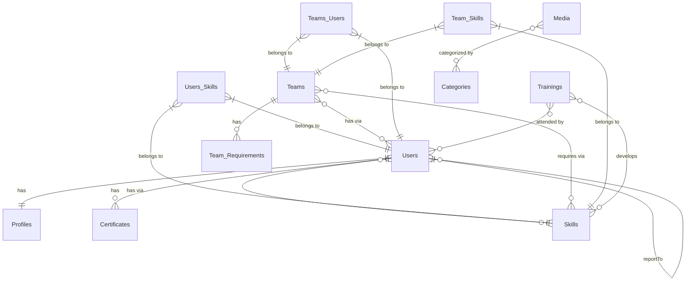

# TeamHub Payload

## Overview

TeamHub Payload is a website template built using Payload CMS, designed to provide a robust and flexible foundation for web development projects. It leverages modern technologies such as Next.js, Tailwind CSS, and a variety of plugins to enhance functionality and user experience.

## Features

- **Payload CMS**: A headless CMS for managing content.
- **Next.js**: A React framework for server-side rendering and static site generation.
- **Tailwind CSS**: A utility-first CSS framework for rapid UI development.
- **Docker Support**: Easily deployable with Docker and Docker Compose.
- **PostgreSQL**: Integrated database support with PostgreSQL.
- **Mailpit**: Email testing with Mailpit.

## Prerequisites

- Node.js (version 18.20.2 or later)
- Docker and Docker Compose
- PNPM (version 10.6.1)

## Installation

1. **Clone the repository**:

   ```bash
   git clone <repository-url>
   cd teamhub-payload
   ```

2. **Install dependencies**:

   ```bash
   pnpm install
   ```

3. **Set up environment variables**:
   - Copy `.env.example` to `.env` and fill in the necessary values.

4. **Run the development server**:
   ```bash
   pnpm dev
   ```

## Docker Setup

1. **Build and run the Docker containers**:

   ```bash
   docker-compose up --build
   ```

2. **Access the application**:
   - The application will be available at `http://localhost:3000`.
   - Mailpit can be accessed at `http://localhost:8025`.

## Scripts

- `pnpm build`: Builds the application for production.
- `pnpm dev`: Starts the development server.
- `pnpm start`: Starts the application in production mode.
- `pnpm lint`: Lints the codebase.
- `pnpm test`: Runs the test suite using Vitest.

## Contributing

Contributions are welcome! Please open an issue or submit a pull request for any improvements or bug fixes.

## License

This project is licensed under the MIT License.

## Entity Relationship Diagram


