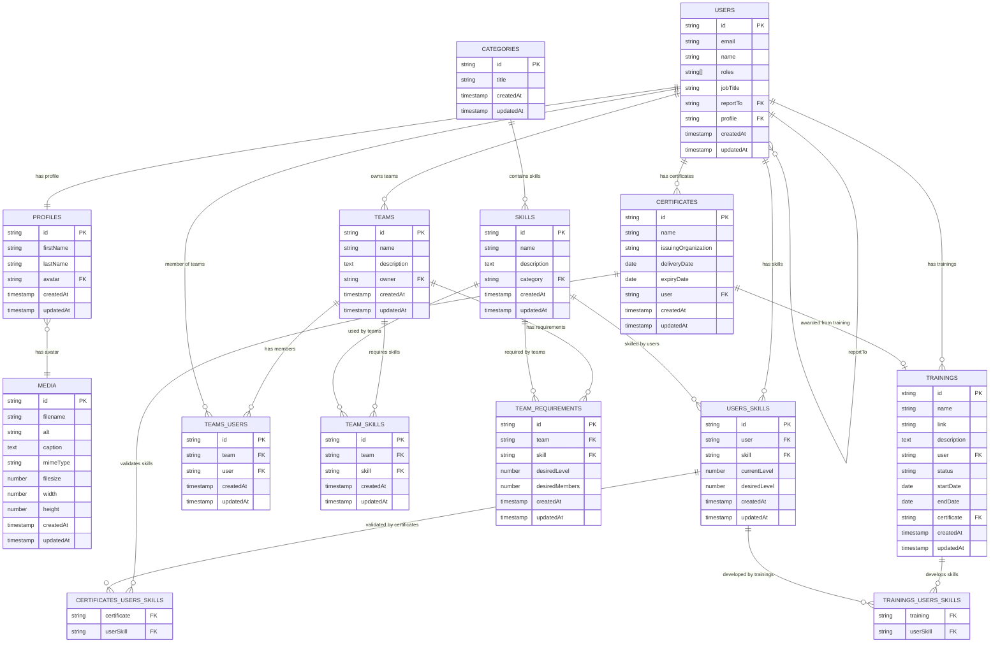

# TeamHub Payload

A modern team management platform built with **Next.js**, **Payload CMS**, **tRPC**, and **Shadcn/UI**.

---

## 🚀 Quick Start

1. **Clone the repository**

   ```sh
   git clone https://github.com/your-org/teamhub-payload.git
   cd teamhub-payload
   ```

2. **Install dependencies**

   ```sh
   pnpm install
   ```

3. **Set up environment variables**

   ```sh
   cp .env.example .env.local
   # Edit .env.local as needed
   ```

4. **Run database migrations**

   ```sh
   pnpm migrate
   ```

5. **(Optional) Seed the database**

   ```sh
   pnpm seed
   ```

6. **Start the development server**

   ```sh
   pnpm dev
   ```

7. **Open the app**
   - Frontend: [http://localhost:3000](http://localhost:3000)
   - Payload Admin: [http://localhost:3000/admin](http://localhost:3000/admin)

---

## 🗂️ Project Structure

- **[src/app](src/app)**: Next.js App Router pages and layouts
- **[src/components](src/components)**: Reusable UI components (Shadcn/UI)
- **[src/collections](src/collections)**: Payload CMS collections
- **[src/server](src/server)**: tRPC routers and server logic
- **[src/migrations](src/migrations)**: Database schema changes
- **[public](public)**: Static files and images

See [Cursor Rules](.cursor/rules/) for detailed conventions.

---

## 🛠️ Scripts

| Command               | Description                       |
| --------------------- | --------------------------------- |
| `pnpm dev`            | Start development server          |
| `pnpm build`          | Build for production              |
| `pnpm start`          | Start production server           |
| `pnpm lint`           | Run ESLint                        |
| `pnpm format`         | Format code with Prettier         |
| `pnpm test`           | Run tests with Vitest             |
| `pnpm migrate`        | Run database migrations           |
| `pnpm generate:types` | Generate Payload TypeScript types |

---

## 🏗️ Architecture


- **Next.js**: Frontend and API routes
- **tRPC**: Type-safe API layer
- **Payload CMS**: Headless CMS and database
- **Shadcn/UI**: Design system and UI components

---

## 🗃️ Entity Relationship Diagram (ERD)

The following ERD visualizes the main entities (collections) and their relationships in the TeamHub Payload CMS schema:



### ERD Summary

- **Users** can have a profile, report to another user, and have many skills, certificates, and trainings.
- **Profiles** can have an avatar (media).
- **Skills** are grouped by categories and linked to users and teams.
- **Teams** have members, skills, and requirements.
- **Certificates** and **Trainings** are linked to users and can validate or develop specific user skills.
- Many-to-many relationships are managed via join tables (e.g., `users_skills`, `teams_users`).

---

## 📋 Collections Summary Table

| Table/Collection      | Purpose/Notes                                 |
|----------------------|-----------------------------------------------|
| Users                | Core user data, roles, reporting structure    |
| Profiles             | Extended user info, avatar                    |
| Skills               | Skill definitions, linked to categories       |
| Categories           | Skill grouping                                |
| UserSkills           | User's skill levels, many-to-many             |
| Teams                | Team info, single owner                       |
| TeamMembers          | Team membership, many-to-many                 |
| TeamSkills           | Skills required by teams                      |
| TeamRequirements     | Desired skill levels/members for teams        |
| Certificates         | User certifications, can validate skills      |
| Trainings            | User trainings, can develop skills            |
| Media                | File uploads, avatars, etc.                   |

---

## 🧑‍💻 Onboarding Checklist

- [ ] Clone the repo
- [ ] Install dependencies
- [ ] Set up `.env.local`
- [ ] Run migrations/seed data
- [ ] Start the dev server
- [ ] Run tests (`pnpm test`)
- [ ] Read [Cursor Rules](.cursor/rules/) for conventions

---

## 📝 Contributing

We welcome contributions! Please see [CONTRIBUTING.md](CONTRIBUTING.md) for our guidelines.

- Use feature branches and open PRs for review.
- Run `pnpm lint` and `pnpm test` before pushing.
- Follow our [Cursor Rules](.cursor/rules/) for code conventions.

---

## 🧩 Useful Links

- [Payload CMS Docs](https://payloadcms.com/docs)
- [Next.js Docs](https://nextjs.org/docs)
- [tRPC Docs](https://trpc.io/docs)
- [Shadcn/UI Docs](https://ui.shadcn.com/docs)
- [Cursor Rules](.cursor/rules/)

---

## 🛡️ Environment Variables

See `.env.example` for all required environment variables and their descriptions.

---

## 💡 Editor & Tooling

- Recommended: VSCode with extensions for ESLint, Prettier, Tailwind CSS, and MDX.
- See `.vscode/extensions.json` for suggestions.

---

## 📄 License

[MIT](LICENSE)
